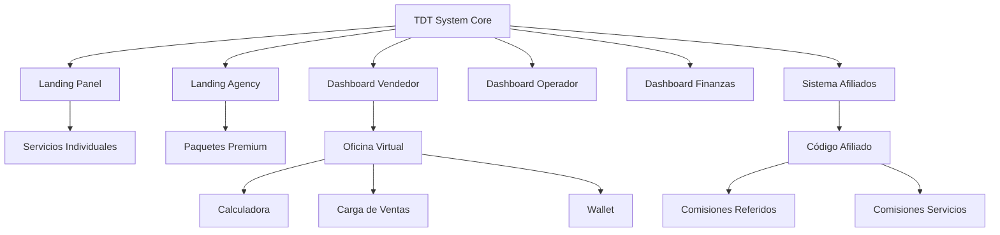

# 1. Visión General del Sistema

## Concepto Central
TDT es una **plataforma multi-brand de comercio digital** que conecta servicios de crecimiento en redes sociales con vendedores independientes, operadores de tráfico, y afiliados, todo orquestado bajo un sistema centralizado de administración, pagos y seguimiento.

## Ecosystem Map

## Marcas del Ecosistema

| Marca | Objetivo | Target | Landing |
|-------|----------|--------|---------|
| **Trend Up** | Servicios individuales de panel | Creadores de contenido, influencers pequeños/medianos | Landing Panel |
| **Trenzo Agency** | Servicios premium, paquetes estratégicos | Marcas, empresas, influencers grandes | Landing Agency |
| **TDT System** | Plataforma backend de administración | Vendedores, operadores, finanzas | Dashboard Admin |
