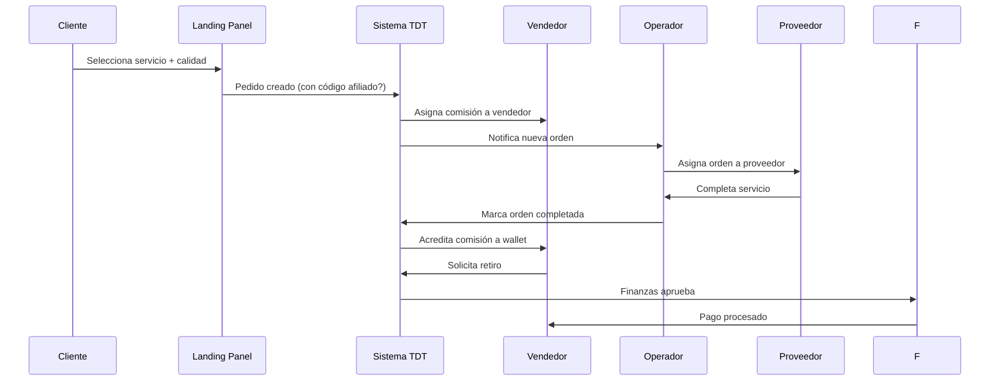
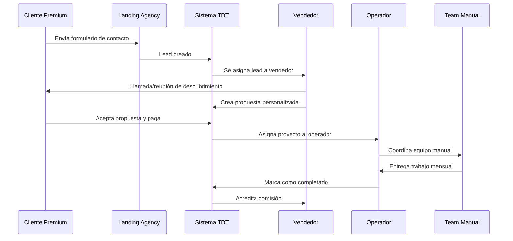

# 5. Flujo de Ventas y Operaciones

## Flujo Completo: Landing Panel

```mermaid
sequenceDiagram
    participant C as Cliente
    participant L as Landing Panel
    participant S as Sistema TDT
    participant V as Vendedor
    participant O as Operador
    participant P as Proveedor
    
    C->>L: Selecciona servicio + calidad
    L->>S: Pedido creado (con código afiliado?)
    S->>V: Asigna comisión a vendedor
    S->>O: Notifica nueva orden
    O->>P: Asigna orden a proveedor
    P->>O: Completa servicio
    O->>S: Marca orden completada
    S->>V: Acredita comisión a wallet
    V->>S: Solicita retiro
    S->>F: Finanzas aprueba
    F->>V: Pago procesado
```

## Flujo Completo: Landing Agency

```mermaid
sequenceDiagram
    participant C as Cliente Premium
    participant L as Landing Agency
    participant S as Sistema TDT
    participant V as Vendedor
    participant O as Operador
    participant T as Team Manual
    
    C->>L: Envía formulario de contacto
    L->>S: Lead creado
    S->>V: Se asigna lead a vendedor
    V->>C: Llamada/reunión de descubrimiento
    V->>S: Crea propuesta personalizada
    C->>S: Acepta propuesta y paga
    S->>O: Asigna proyecto al operador
    O->>T: Coordina equipo manual
    T->>O: Entrega trabajo mensual
    O->>S: Marca como completado
    S->>V: Acredita comisión
```
