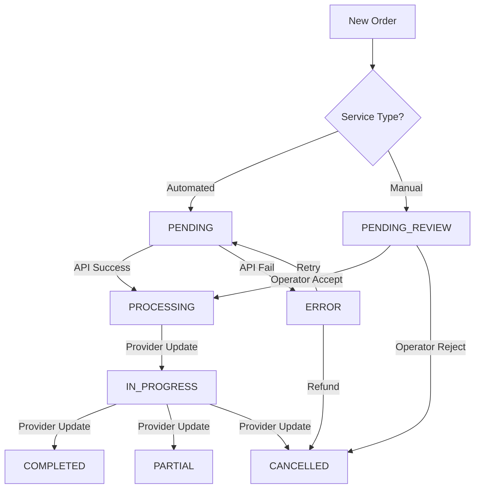

# Order Workflow & Lifecycle

## 🔄 Order Lifecycle

### 1. Order Creation
- **Trigger:** User completes checkout or Vendor creates manual order.
- **Initial State:** `PENDING`
- **Actions:**
  - Validate balance (if wallet payment).
  - Deduct balance.
  - Create transaction record.
  - Send confirmation email.

### 2. Processing (Automated)
- **Trigger:** System cron/webhook picks up `PENDING` order.
- **Action:** Send to SMM Provider API.
- **Success:**
  - Update State: `PROCESSING`
  - Save Provider Order ID.
- **Failure:**
  - Update State: `ERROR`
  - Notify Admin/Operator.

### 3. Processing (Manual / Agency)
- **Trigger:** Order for Agency Service created.
- **State:** `PENDING_REVIEW`
- **Operator Action:**
  - Review requirements.
  - Accept Order -> State: `IN_PROGRESS`
  - Reject Order -> State: `CANCELLED` (Refund triggered).

### 4. Status Updates
- **Trigger:** Webhook from Provider or Manual Update.
- **States:**
  - `IN_PROGRESS`: Service is being delivered.
  - `COMPLETED`: Service fully delivered.
  - `PARTIAL`: Partially delivered (Refund remaining amount).
  - `CANCELLED`: Cancelled by provider (Full refund).

---

## 🚦 State Machine

## ⚠️ Exception Handling

### Insufficient Funds
- Prevent order creation.
- Show "Top up wallet" modal.

### API Error (Provider Down)
- Keep order in `PENDING`.
- Retry logic (Exponential backoff: 1m, 5m, 15m).
- After 3 retries -> Move to `ERROR`.

### Partial Completion
- Calculate undelivered amount.
- Refund difference to Vendor Wallet.
- Mark order as `PARTIAL`.

### Cancellation
- Full refund to Vendor Wallet.
- Mark order as `CANCELLED`.
- Send notification.
